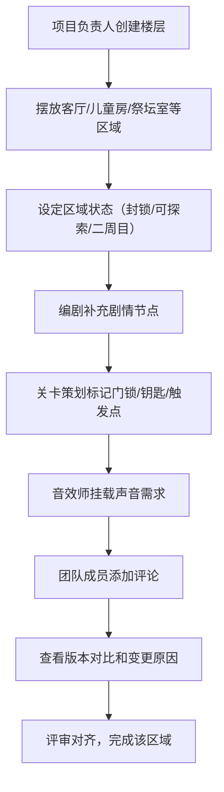

## 1. 产品概述

鬼屋空间叙事协作蓝图板是一款面向小型恐怖游戏开发团队的Web协作工具，用于统一关卡策划、编剧和音效师对鬼屋空间叙事的理解。通过可视化楼层蓝图、节点化剧情管理和团队评审机制，减少跨角色沟通成本，加速原型期的设计对齐。

- **目标用户**：3-10人规模的独立恐怖游戏开发团队，包含关卡策划、编剧、音效师等角色
- **核心价值**：将分散的设计文档整合为可视化蓝图，让团队成员在同一空间坐标系下讨论叙事与玩法的融合

## 2. 核心功能

### 2.1 用户角色
| 角色 | 核心职责 | 主要功能 |
|------|----------|----------|
| 项目负责人 | 创建楼层、规划区域布局、设定区域状态 | 楼层蓝图编辑、区域状态管理 |
| 编剧 | 补充剧情节点，设计进入/调查/离开时的叙事内容 | 剧情节点编辑、叙事文本撰写 |
| 关卡策划 | 标记门锁、钥匙、追逐触发点、藏身点等玩法元素 | 玩法标记编辑、冲突检测 |
| 音效师 | 在节点上挂载声音需求，注明触发条件和距离 | 音效节点编辑、触发参数设置 |
| 全体成员 | 评论、查看版本历史、参与团队评审 | 评论系统、版本对比、评审视图 |

### 2.2 功能模块
1. **楼层蓝图区**：可视化展示鬼屋楼层布局，支持区域拖拽摆放、状态标记
2. **节点详情面板**：展示选中区域/节点的详细信息，包含剧情、玩法、音效三个维度
3. **团队评审模块**：评论区、版本历史对比、变更说明

### 2.3 页面详情
| 页面名称 | 模块名称 | 功能描述 |
|----------|----------|----------|
| 主工作区 | 楼层蓝图画布 | 2D俯视图展示楼层布局，可添加/删除/移动房间区域，显示区域状态和动线连接 |
| 主工作区 | 工具栏 | 楼层切换、区域添加、缩放控制、视图模式切换（蓝图/评审） |
| 主工作区 | 区域状态图例 | 显示封锁/可探索/二周目变化等状态的颜色标识 |
| 右侧面板 | 节点详情 | 展示选中区域的所有信息，分剧情/玩法/音效三个标签页 |
| 右侧面板 | 剧情节点编辑 | 进入/调查/回头离开三个触发时机的文本编辑，支持多分支剧情 |
| 右侧面板 | 玩法标记编辑 | 添加门锁、钥匙、追逐触发点、藏身点，标记位置和关联关系 |
| 右侧面板 | 音效节点编辑 | 添加风声/敲门/低语等音效，设置触发距离、音量、循环方式 |
| 底部面板 | 评论区 | 针对当前选中区域的团队评论，支持@提及和回复 |
| 底部面板 | 版本历史 | 展示该区域的修改记录，支持两个版本的内容对比 |
| 底部面板 | 团队评审 | 显示待解决问题、评审结论、变更原因说明 |

## 3. 核心流程

项目负责人创建楼层并摆放房间区域 → 编剧在各房间补充剧情节点 → 关卡策划标记玩法元素并检查冲突 → 音效师挂载声音需求 → 团队成员评论并查看版本变化 → 通过评审视图对齐理解

## 4. 用户界面设计

### 4.1 设计风格
- **主色调**：深炭灰 (#0F0F12) 为背景，暗红 (#8B1A1A) 为强调色，冷灰蓝 (#4A5568) 为辅助色，营造恐怖悬疑氛围
- **次色调**：区域状态色 - 封锁=暗红渐变、可探索=深绿、二周目变化=紫铜色
- **按钮风格**：细边框矩形按钮，悬停时有微弱的红色光晕效果
- **字体**：标题使用 "Cinzel" 衬线字体（哥特风格），正文使用 "Noto Sans SC" 保持可读性
- **布局风格**：三栏布局 - 左侧工具栏+图例，中间蓝图画布，右侧详情面板，底部评审/评论区
- **视觉效果**：纸张纹理背景叠加、区域边缘有微弱的烧焦效果、节点选中时有脉冲式红光边框

### 4.2 页面设计概述
| 页面名称 | 模块名称 | UI元素 |
|----------|----------|--------|
| 主工作区 | 楼层蓝图画布 | 深色背景+网格纹理，房间区域用卡片式矩形表示，内部显示房间名和状态图标，动线用虚线连接，悬停放大效果，选中时红色脉冲边框 |
| 主工作区 | 工具栏 | 左侧垂直工具栏，图标式按钮，楼层切换下拉框，缩放滑块 |
| 右侧面板 | 节点详情 | 三个标签页（剧情/玩法/音效），每个标签页内用卡片分组信息，编辑区使用深色文本框 |
| 底部面板 | 评论与评审 | 可折叠面板，评论列表带头像和时间戳，版本对比使用分屏左右布局，差异文字高亮显示 |

### 4.3 响应式
- 桌面端优先设计（1280px以上），三栏布局完整展示
- 平板端（768-1280px）底部面板改为Tab切换，右侧面板可折叠
- 移动端：蓝图画布全屏，详情和评审用抽屉式面板

### 4.4 交互动效
- 页面加载：各区域按动线顺序淡入
- 区域选中：红色脉冲边框动画
- 面板切换：平滑滑动过渡
- 版本对比：差异文字逐字高亮显现
