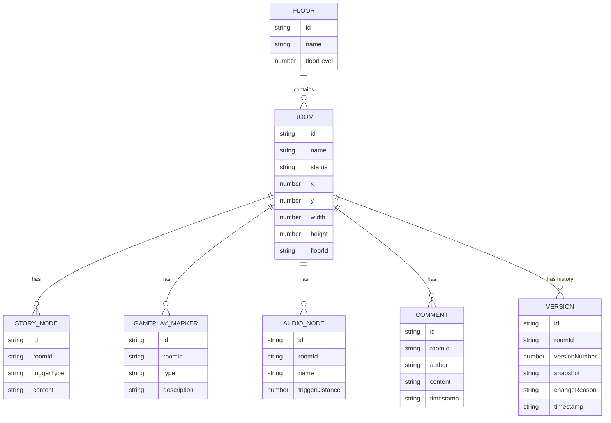

## 1. 架构设计

```mermaid
graph TD
    subgraph "前端层"
        A["React 18 应用"] --> B["状态管理 (Zustand)
        A --> C["UI 组件层"]
        C --> C1["楼层蓝图画布"]
        C --> C2["节点详情面板"]
        C --> C3["团队评审模块"]
        A --> D["样式层 (Tailwind CSS)"]
    end
    
    subgraph "数据层"
        E["Mock 数据 (LocalStorage)"] --> F["楼层数据"]
        E --> G["区域/节点数据"]
        E --> H["评论与版本数据"]
    end

    subgraph "交互层"
        I["拖拽交互"]
        J["版本对比算法"]
        K["冲突检测逻辑"]
    end
```

## 2. 技术描述

- **前端框架**: React@18 + TypeScript
- **构建工具**: Vite@5
- **样式方案**: Tailwind CSS@3
- **状态管理**: Zustand (轻量级状态管理)
- **图标库**: Lucide React
- **拖拽功能**: 原生 HTML5 Drag & Drop API + 自定义实现
- **数据存储**: LocalStorage (本地存储 Mock 数据，模拟协作场景
- **字体**: Google Fonts (Cinzel + Noto Sans SC)

## 3. 路由定义

| 路由 | 用途 |
|-------|------|
| / | 主工作区（单页应用，无额外路由） |

本项目采用单页应用架构，所有功能模块在同一页面内通过面板切换实现。

## 4. 数据模型

### 4.1 数据实体关系



### 4.2 数据类型定义 (TypeScript)

```typescript
// 区域状态类型
type RoomStatus = 'locked' | 'explorable' | 'second_run' | 'normal';

// 剧情触发类型
type StoryTriggerType = 'enter' | 'investigate' | 'leave';

// 玩法标记类型
type GameplayMarkerType = 'door_lock' | 'key' | 'chase_trigger' | 'hiding_spot';

// 楼层
interface Floor {
  id: string;
  name: string;
  floorLevel: number;
}

// 房间区域
interface Room {
  id: string;
  name: string;
  status: RoomStatus;
  x: number;
  y: number;
  width: number;
  height: number;
  floorId: string;
  connections: string[];
}

// 剧情节点
interface StoryNode {
  id: string;
  roomId: string;
  triggerType: StoryTriggerType;
  content: string;
  branches?: StoryBranch[];
}

interface StoryBranch {
  id: string;
  condition: string;
  content: string;
}

// 玩法标记
interface GameplayMarker {
  id: string;
  roomId: string;
  type: GameplayMarkerType;
  name: string;
  description: string;
  linkedTo?: string;
}

// 音效节点
interface AudioNode {
  id: string;
  roomId: string;
  name: string;
  triggerDistance: number;
  volume: number;
  loop: boolean;
  description: string;
}

// 评论
interface Comment {
  id: string;
  roomId: string;
  author: string;
  role: string;
  avatar: string;
  content: string;
  timestamp: string;
  replies?: Comment[];
}

// 版本记录
interface Version {
  id: string;
  roomId: string;
  versionNumber: number;
  snapshot: RoomSnapshot;
  changeReason: string;
  author: string;
  timestamp: string;
}

interface RoomSnapshot {
  name: string;
  status: RoomStatus;
  storyNodes: StoryNode[];
  gameplayMarkers: GameplayMarker[];
  audioNodes: AudioNode[];
}
```

## 5. 组件结构

```
src/
├── components/
│   ├── BlueprintCanvas/        # 楼层蓝图画布
│   │   ├── index.tsx
│   │   ├── RoomCard.tsx    # 房间区域卡片
│   │   └── ConnectionLine.tsx
│   ├── Toolbar/             # 左侧工具栏
│   │   └── index.tsx
│   │   └── Legend.tsx      # 状态图例
│   ├── DetailPanel/         # 右侧详情面板
│   │   ├── index.tsx
│   │   ├── StoryTab.tsx    # 剧情标签页
│   │   ├── GameplayTab.tsx   # 玩法标签页
│   │   └── AudioTab.tsx      # 音效标签页
│   ├── ReviewPanel/         # 底部评审面板
│   │   ├── index.tsx
│   │   ├── Comments.tsx      # 评论区
│   │   ├── VersionHistory.tsx # 版本历史
│   │   └── VersionDiff.tsx     # 版本对比
├── store/
│   └── useBlueprintStore.ts # Zustand 状态管理
├── data/
│   └── mockData.ts          # Mock 初始数据
├── types/
│   └── index.ts           # TypeScript 类型定义
├── utils/
│   └── diff.ts            # 版本对比工具函数
├── App.tsx
├── main.tsx
└── index.css
```
